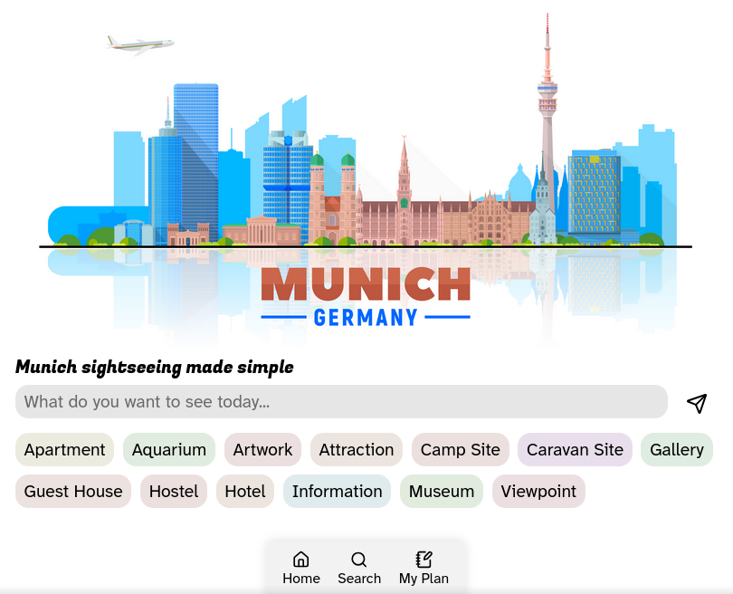
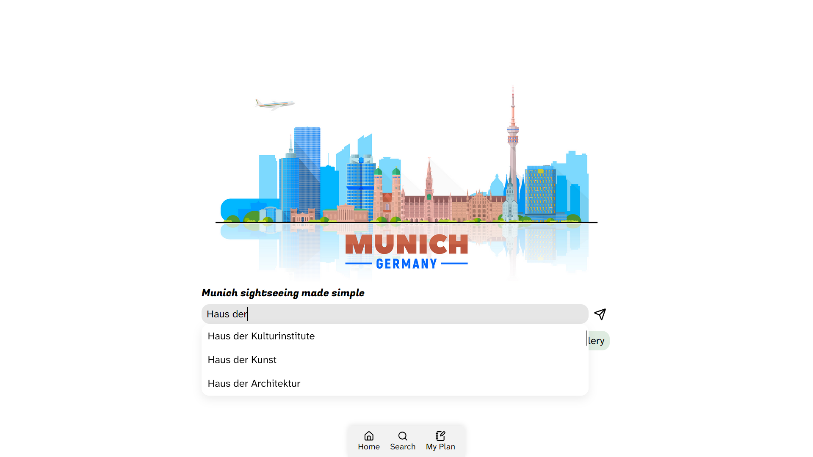
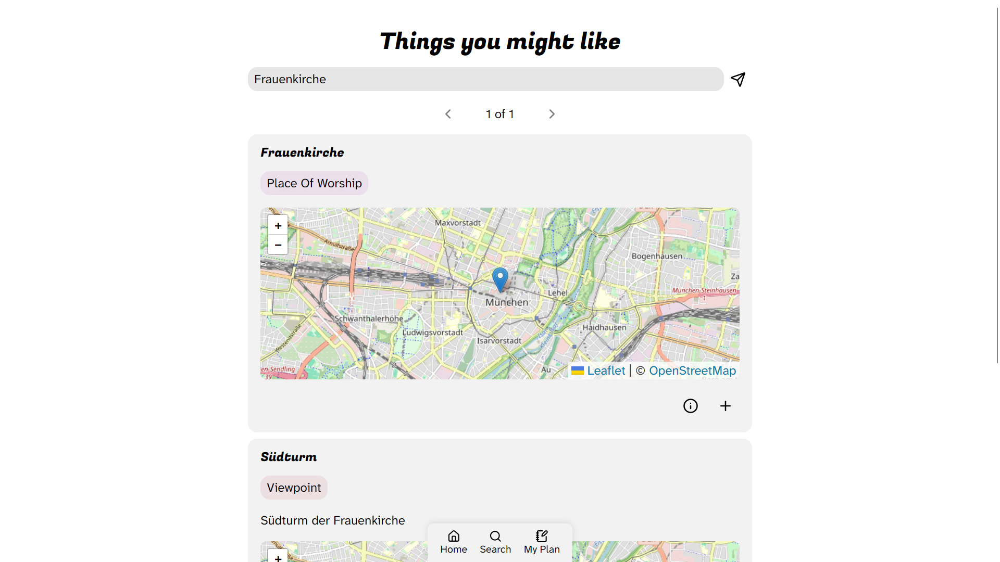
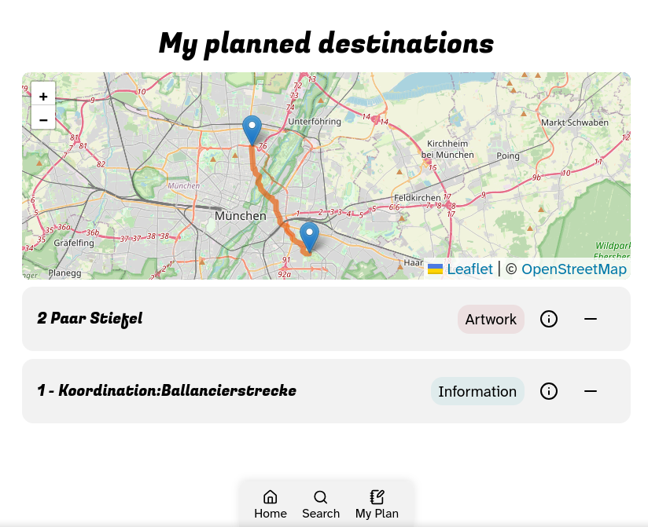

# TRAlNS - Hackatum 2025

Sometimes it's really hard to find stuff to do in the city if you don't want to spend money. Sometimes we just want to chill and exist in our beautiful city without consuming. 

**T**he **R**eally **A**ffordable **l**eisure **N**avigation **S**ervice (**TRAlNS**) will make this easier! In this platform, users can discover destinations and plan outings. We want to help answer questions like:

- 🚂 Where can my D-ticket take me for a day trip?
- 🚰 What free amenities are around this cool spot? (benches, drinking water, toilets, parks)
- 🎭 What activities can I do with x money in y time?
- 💃 What cool and free events are in my area?
- 📣 What's going on around my area: demos, citizen exchanges, calls for volunteering, etc?

## Screenshots

**Home menu**


**Autocomplete**


**Search Results**


**Amenities**


**Planning menu**


## Implementation

### Frontend
We use Svelte+TS

### Backend
Python with common libraries (OSMPythonTools, OSMnx) to query Overpass and Nominatim. ALso, OpenRouteService for routing.

## Installation

### Prerequisites

- Python >= 3.8
- make
- bun
- An OpenRouteService API key

### Usage

After cloning and cd-ing the repo, create a `.env` file with your OpenRouteService API key in the `src/backend` directory (there's an example file),

To run the backend:

```bash
cd src/backend
make setup
make
```

Will begin serving the API endpoints

To run the frontend

```bash
cd src/frontend
make setup
make
```
Will begin serving the frontend.

Enjoy!

### Slides

```bash
bun install -g cleaver
cleaver --debug slides.md --title TRAlNS
```

### Credit
- Munich Skyline Picture: https://www.freepik.com/free-vector/munich-germany-skyline-with-panorama-white-background-vector-illustration_23307297.htm#fromView=search&page=1&position=4&uuid=8bbad2eb-d925-4a89-aeb5-bd1e2eda710b&query=Munich
- OpenStreetMap for maps and search results
- OpenRouteService for autocompletion and navigation