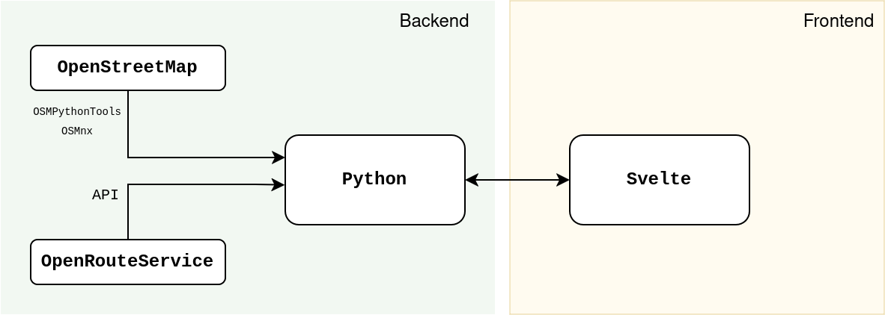

title: TRAlNS - Hackatum 2025
output: slides.html
style: style.css
--

# **TRAlNS**
## **T**he **R**eally **A**ffordable **l**eisure **N**avigation **S**ervice 

by: [🚄 Opisek](https://opisek.net/), [🦆 Hanna](https://github.com/DucklearExplosion), 🥼 Nico, [🎲 Leo](https://github.com/poleomanta)

HackaTUM - November 2025

--

# Problem

❌ It's really hard to find stuff to do in the city if you don't want to spend money.

✅ We want to chill and exist in our beautiful city. 
--
## We want to answer:

* 🚂 Where can my D-ticket take me for a day trip?
* 🚰 What free amenities are around this cool spot? (benches, drinking water, toilets, parks)
* 🎭 What activities can I do with x money in y time?
* 💃 What cool and free events are in my area?
* 📣 What's going on around my area? Demos, citizen exchanges, calls for volunteering, etc?
--

### Implementation

--

# Live Demo!

--
# Q&A
# 🦆 🥼 Thank you! 🚄🎲
--